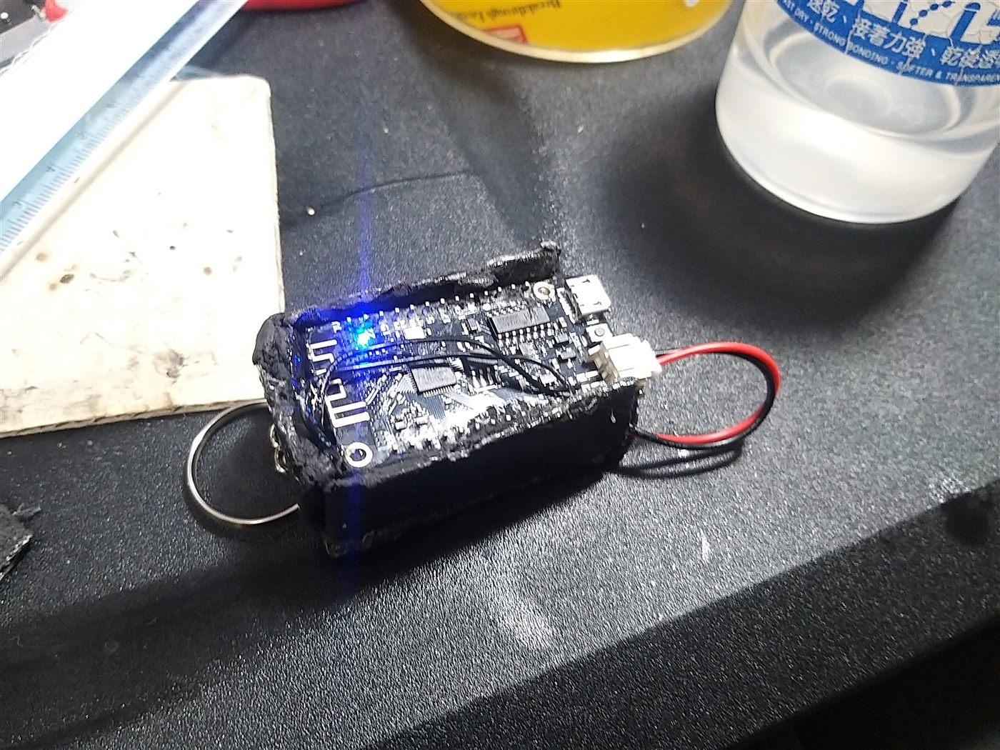
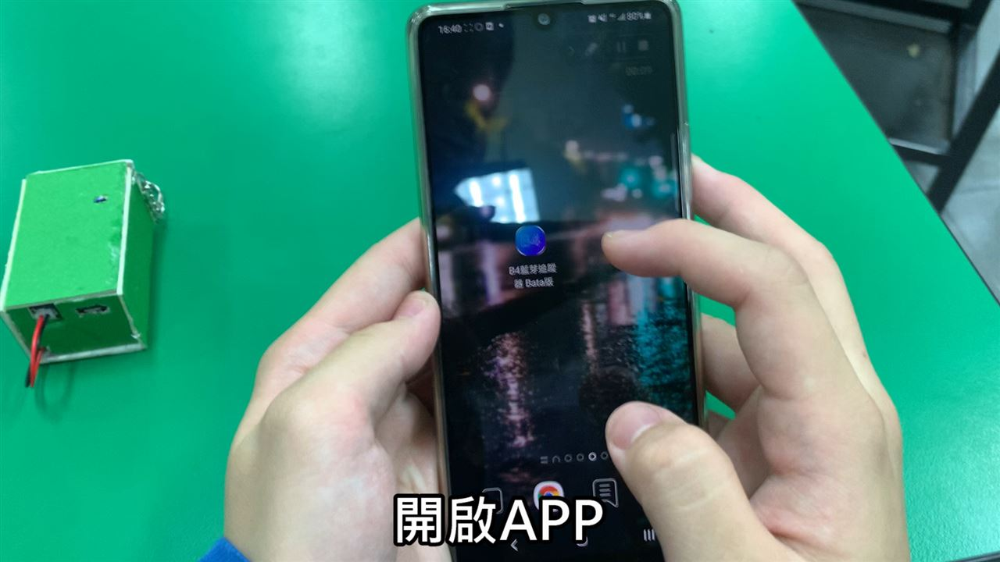
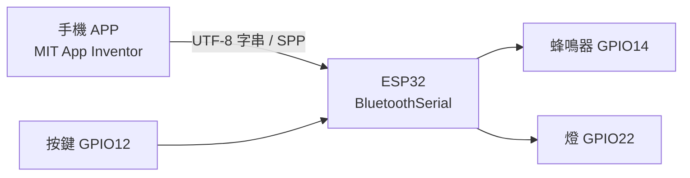

<p align="center">
  <a href="#readme"></a>
  <a href="docs/README.en.md"></a>
</p>

<p align="center">
  
</p>

<h1 align="center">B4 Bluetooth Tracker</h1>

<p align="center">
  <strong>藍芽失物協尋器</strong><br>
  手機下指令，鑰匙圈上的 ESP32 就響、就亮。<br>
  2021 高職商管群專題的概念實作，不是市售定位器。
</p>

<p align="center">
  
  
  
  
  
  
  
</p>

<p align="center">
  <a href="#功能">功能</a> ·
  <a href="#示範">示範</a> ·
  <a href="#架構">架構</a> ·
  <a href="#安裝">安裝</a> ·
  <a href="#專案結構">結構</a> ·
  <a href="#貢獻">貢獻</a> ·
  <a href="docs/README.md">文件索引</a> ·
  <a href="CHANGELOG.md">變更紀錄</a>
</p>

---

錢包、鑰匙、遙控器——東西還在同一個房間，卻找不到。B4 不做 GPS、不上雲：手機用 **MIT App Inventor** 連上掛件裡的 **ESP32**，用一段 Classic Bluetooth 序號埠把中文指令送過去。裝置用 PWM 把蜂鳴器唱出來，燈也跟著亮。人循著聲音走過去，就是協尋。

> **現況。** 這是 2021 學年度（民國 110）三庚專題 B 第四組的繳交成品，2026 年才收成可公開的展示倉。韌體停在 `BT9`，APP 停在 `esp_teat10-0914-2`。成片在 [YouTube](https://youtu.be/bfgeC1RDvt0)；問卷只放聚合統計，不上傳原始回覆。

## 功能

<table>
<tr>
<td width="33%" valign="top">

### 配對與指令

APP 用 `ListPicker` 掃到名為「追蹤器1」的裝置，之後每個按鈕送一行 UTF-8 字串。韌體在 `loop()` 裡比對，沒有自訂二進位協定。

</td>
<td width="33%" valign="top">

### 循聲協尋

五種找尋鈴聲、七段音量（`vi0`–`vi6`）、播放中可換曲或停止。機上 GPIO12 按鍵也能中斷，以免找不到手機時一直叫。

</td>
<td width="33%" valign="top">

### 實體掛件

Lolin32 Lite、3.7 V 500 mAh 鋰電、無源蜂鳴器、輕觸開關、樹脂／手作外殼與鑰匙圈。設計從 2×2×1 cm 收斂到實作約 5×2 cm。

</td>
</tr>
</table>

| 還有這些 | 為什麼這樣做 |
| --- | --- |
| **耐摔當賣點** | 問卷 354 人裡，約 79% 同意「耐摔、耐用」；外觀分數反而偏低。專題把耐用寫進研究目的，不是順便測的。 |
| **不追蹤位置** | Classic Bluetooth 沒有座標。距離就是喇叭聽得到的範圍，簡報也誠實寫了這點。 |
| **積木產生、手改收尾** | 韌體開頭來自 [TUNIOT for ESP32](https://easycoding.tn/)，音量、中斷、循環播放是後來手寫的。 |

## 示範

成片（約 2021-12）：[三庚專題 B 第四組 · 概念實作](https://youtu.be/bfgeC1RDvt0)

<p align="center">
  
</p>
<p align="center"><sub>手作外殼與 Lolin32 Lite。USB 充電口外露；藍燈為板上電源指示。</sub></p>

<p align="center">
  
</p>
<p align="center"><sub>課堂錄影截圖：APP 圖示為「B4藍芽追蹤 Beta版」，綠色盒為後期上色外殼。</sub></p>

### 一條完整路徑

```text
開啟 APP → 進入測試畫面
        ↓
ListPicker 選擇「追蹤器1」並連線
        ↓
開燈 / 調音量 vi0–vi6 / 選一首找尋鈴聲
        ↓
人循聲走近；或按「停止播放」／按機上按鈕
        ↓
關燈，結束這一輪
```

指令表、腳位與已知限制在 [`docs/protocol.md`](docs/protocol.md)、[`docs/hardware.md`](docs/hardware.md)。

## 架構



兩邊都只認同一張字串表。APP 不解析 RSSI、不做地圖；韌體不回報電量、不廣播 BLE。

| 層 | 位置 | 責任 |
| --- | --- | --- |
| 手持端 | `app/B4-tracker.aia` | 配對、送指令、音量圖示 |
| 韌體 | `firmware/BT9/` | 解指令、PWM 播譜、循環與中斷 |
| 音高表 | `firmware/BT9/notes.h` | `C0`–`B8` 頻率巨集 |
| 展示文件 | `docs/` | 硬體、協定、問卷、韌體沿革 |

<details>
<summary><strong>技術細節（可折疊）</strong></summary>

<br>

- 啟動後 `delay(5000)` 才 `SerialBT.begin("追蹤器1")`，避免上電瞬間配對失敗。
- 燈是低態驅動：`開燈` → `GPIO22 LOW`，`關燈` → `HIGH`。
- 音量不是 dB，是把譜上的 duty 乘上 `btdutyCycle`（100 / 60 / 20 / 15 / 10 / 5 / 0）。
- 各曲播完若未停止會**遞迴再播**；換曲走 `dost()`。`Pekora()` 有一處誤用 `sizeof(glnote)`，歷史碼照留，見 [`docs/firmware.md`](docs/firmware.md)。
- 展示倉只刪了 `BT9.ino` 裡重複定義的第一份 `volume()`，否則無法編譯。行為與 2021 繳交版相同。
- 鈴聲名稱對應課堂示範曲，**不是**可再散布的商業曲譜。授權說明見 [`LICENSE`](LICENSE)。

</details>

## 安裝

需要 Arduino IDE（或 CLI）、[arduino-esp32](https://docs.espressif.com/projects/arduino-esp32/en/latest/installing.html) 核心，以及一支 Lolin32 Lite 相容板。APP 用瀏覽器開 [MIT App Inventor](https://appinventor.mit.edu/)。

### 1. 燒錄韌體

1. 用 USB 接上板子，選開發板 **WEMOS LOLIN32**（或同等 ESP32）與對應 COM。
2. 開啟 `firmware/BT9/BT9.ino`（同目錄需有 `notes.h`）。
3. 確認 `工具 → Bluetooth` 已啟用（官方 ESP32 核心預設即可）。
4. 上傳。序列埠 115200 會印出裝置位址。

### 2. 載入 APP

1. 到 App Inventor → *Projects → Import project (.aia)* → 選 `app/B4-tracker.aia`。
2. 用 Companion 或打包 APK 裝到 Android 手機。
3. 系統設定先配對「追蹤器1」，再回 APP 用清單連線。

腳位改了請同時改 [`docs/hardware.md`](docs/hardware.md) 與 `BT9.ino` 的常數。Windows 開發機建議 COM 口不要被其他序列工具佔住。

## 專案結構

```text
firmware/BT9/          最終韌體（ino + notes.h）
app/B4-tracker.aia     App Inventor 來源（2021-09-14）
docs/                  說明與圖片；英文對照在 README.en.md
LICENSE                MIT
CONTRIBUTING.md        貢獻約定
CHANGELOG.md           Keep a Changelog 2.0.0
original-data/         8.6 GB 原料庫，已被 .gitignore
```

完整樹狀與「為什麼沒把影片／問卷 csv 放進來」見 [`docs/README.md`](docs/README.md)。

## 貢獻

這是封存的學生專題。歡迎修正文件錯字、補編譯註記、加自製提示音；請不要把 `original-data/` 或問卷原始列推進公開分支。細節在 [`CONTRIBUTING.md`](CONTRIBUTING.md)。

## 授權

程式與文件：[MIT](LICENSE) © 2021 張任沂、徐家宥、鐘昱為。指導老師：劉倩如。

課堂鈴聲只供重現當年展示，不授權那些旋律本身。第三方函式庫（u8g2、CMSIS 等）留在被忽略的原料庫，不構成本倉的一部分。

---

<p align="center">
  <sub>三庚專題 B · 第四組 · 民國 110 學年度</sub>
</p>
