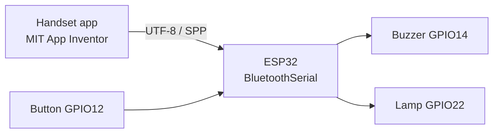

<div align="center">
  <a href="../README.md"></a>
  <a href="#readme"></a>
</div>

<div align="center">
  
</div>

<h1 align="center">B4 Bluetooth Tracker</h1>

<div align="center">
  <strong>A Bluetooth lost-item finder</strong><br>
  The handset issues a command; the ESP32 on the key ring rings and lights up.<br>
  A 2021 vocational-school capstone — not a commercial locator.
</div>

<div align="center">
  
  
  
  
  
  
  
</div>

<div align="center">
  <a href="#features">Features</a> ·
  <a href="#demo">Demo</a> ·
  <a href="#architecture">Architecture</a> ·
  <a href="#installation">Installation</a> ·
  <a href="#project-structure">Structure</a> ·
  <a href="#contributing">Contributing</a> ·
  <a href="./README.md">Docs index</a> ·
  <a href="../CHANGELOG.md">Changelog</a>
</div>

---

Wallets, keys, remotes — still in the same room, still invisible. B4 does not do GPS and does not talk to a cloud. A **MIT App Inventor** handset opens a **Classic Bluetooth** serial port to the **ESP32** in the fob and sends one UTF-8 line. The board PWM-sings through a buzzer and pulls an LED. You walk towards the sound.

English in this repository is **English**.

> **Status.** This is the submitted build from academic year 2021 (ROC 110), group B4 of class 3-Geng, packaged for GitHub in 2026. Firmware is frozen at `BT9`; the app is frozen at `esp_teat10-0914-2`. The film is on [YouTube](https://youtu.be/bfgeC1RDvt0). The survey appears only as aggregates — raw replies stay out of the tree.

## Features

<table>
<tr>
<td width="33%" valign="top">

### Pair and command

The app’s `ListPicker` finds the device named `追蹤器1`. Each control sends one string. The firmware compares text in `loop()`; there is no custom binary protocol.

</td>
<td width="33%" valign="top">

### Find by sound

Five locate tones, seven volume steps (`vi0`–`vi6`), and the ability to change or stop a tune while it plays. GPIO12 on the fob also interrupts, so the unit is not stuck screaming if the phone is the thing you lost.

</td>
<td width="33%" valign="top">

### A physical fob

Lolin32 Lite, a 3.7 V 500 mAh cell, a passive buzzer, a tactile switch, a hand-made resin case and a key ring. The sketch started at 2×2×1 cm and settled near 5×2 cm once the battery and USB port were real.

</td>
</tr>
</table>

| Also | Why |
| --- | --- |
| **Drop resistance was the claim** | About 79% of 354 respondents agreed it looked durable. Appearance scored poorly. The brief treated toughness as a research goal, not a side test. |
| **No coordinates** | Classic Bluetooth has no fix. Range is whatever the speaker can shout. The 2021 slides said so. |
| **Blocks, then handwriting** | The sketch header comes from [TUNIOT for ESP32](https://easycoding.tn/). Volume, interrupt and loop-play were added by hand. |

## Demo

The 2021 film: [Group B4 · concept build](https://youtu.be/bfgeC1RDvt0)

<div align="center">
  
</div>
<div align="center"><sub>Hand-made case and a Lolin32 Lite. The USB charging port stays exposed; the blue LED is the board power indicator.</sub></div>

<div align="center">
  
</div>
<div align="center"><sub>Classroom still: the icon reads “B4藍芽追蹤 Beta版”; the green box is a later painted shell.</sub></div>

### One full path

```text
Open the app → Test screen
        ↓
ListPicker → connect to 追蹤器1
        ↓
Lamp on / volume vi0–vi6 / pick a locate tone
        ↓
Walk towards the sound; or Stop / press the fob button
        ↓
Lamp off
```

Commands, pins and known limits: [`protocol.md`](protocol.md), [`hardware.md`](hardware.md).

## Architecture



Both ends share one string table. The app never reads RSSI or draws a map. The firmware never reports battery or advertises BLE.

| Layer | Path | Job |
| --- | --- | --- |
| Handset | `app/B4-tracker.aia` | Pair, send, volume glyphs |
| Firmware | `firmware/BT9/` | Decode, PWM score, loop and stop |
| Pitch table | `firmware/BT9/notes.h` | `C0`–`B8` frequency macros |
| Docs | `docs/` | Hardware, protocol, survey, firmware notes |

<details>
<summary><strong>Technical notes (collapsed)</strong></summary>

<br>

- `setup()` waits 5 s before `SerialBT.begin("追蹤器1")` so a cold boot does not miss the first pair.
- The lamp is active-low: `開燈` drives GPIO22 `LOW`.
- Volume is not decibels; score duty is multiplied by `btdutyCycle` (100 / 60 / 20 / 15 / 10 / 5 / 0).
- Each tune recurses if nobody stopped it; a change of tune goes through `dost()`. `Pekora()` historically passes `sizeof(glnote)` — left as submitted; see [`firmware.md`](firmware.md).
- The showcase tree deletes only the first duplicate `volume()` in `BT9.ino`, which would not compile otherwise. Behaviour matches the 2021 hand-in.
- Tone names point at classroom demonstration tunes. They are **not** a licence to redistribute those compositions. See [`../LICENSE`](../LICENSE).

</details>

## Installation

You need the Arduino IDE (or CLI), the [arduino-esp32](https://docs.espressif.com/projects/arduino-esp32/en/latest/installing.html) core, and a Lolin32 Lite-class board. The app is imported in a browser at [MIT App Inventor](https://appinventor.mit.edu/).

### 1. Flash the firmware

1. Plug in USB. Choose **WEMOS LOLIN32** (or equivalent ESP32) and the right COM port.
2. Open `firmware/BT9/BT9.ino` (`notes.h` must sit beside it).
3. Leave Bluetooth enabled in the ESP32 core (the default).
4. Upload. The serial monitor at 115200 prints the device address.

### 2. Load the app

1. App Inventor → *Projects → Import project (.aia)* → `app/B4-tracker.aia`.
2. Companion or a packaged APK on an Android handset.
3. Pair `追蹤器1` in system settings, then connect from the list in the app.

If you move a pin, change [`hardware.md`](hardware.md) and the constants in `BT9.ino` together. On Windows, keep other serial tools off that COM port.

## Project structure

```text
firmware/BT9/          Final firmware (ino + notes.h)
app/B4-tracker.aia     App Inventor source (14 Sep 2021)
docs/                  Notes and pictures; this file is the English tour
LICENSE                MIT
CONTRIBUTING.md        How to send a change
CHANGELOG.md           Keep a Changelog 2.0.0
original-data/         8.6 GB working dump; gitignored
```

The full tree and the reason films / raw survey rows stay out: [`README.md`](README.md).

## Contributing

This is an archived school project. Documentation fixes, build notes and original prompt tones are welcome. Do not push `original-data/` or raw questionnaire rows to a public branch. See [`../CONTRIBUTING.md`](../CONTRIBUTING.md) and [`CONTRIBUTING.en.md`](CONTRIBUTING.en.md).

## Licence

Code and docs: [MIT](../LICENSE) © 2021 Zhang Ren-Yi (張任沂), Xu Jia-You (徐家宥), Zhong Yu-Wei (鐘昱為). Adviser: Liu Qian-Ru (劉倩如).

The classroom tones exist so the 2021 demo can be reproduced. They do not licence the underlying melodies. Third-party trees (u8g2, CMSIS, …) remain in the ignored dump and are not part of this repository.

---

<div align="center">
  <sub>Class 3-Geng, stream B, group 4 · academic year 2021 (ROC 110)</sub>
</div>
