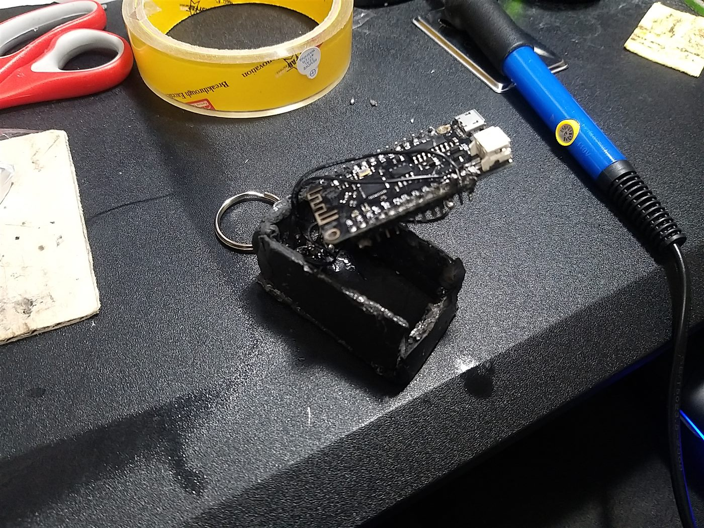
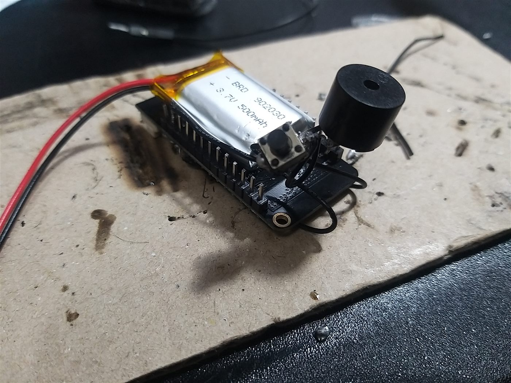
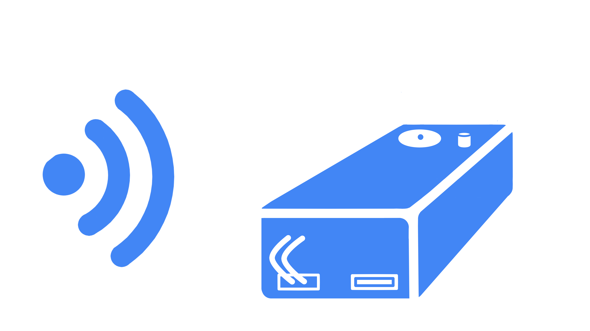

# 硬體

English readers: pin table and bill of materials below are bilingual. Narrative is Traditional Chinese.

## 用料 / Bill of materials

| 項目 Item | 實作 As built | 備註 Notes |
| --- | --- | --- |
| 主控 MCU | ESP32 Wemos Lolin32 Lite | Arduino 選 WEMOS LOLIN32 |
| 電池 Cell | 3.7 V 500 mAh LiPo（殼印 902030） | USB 充電，口外露 |
| 蜂鳴器 Buzzer | 無源，PWM | `GPIO14`，LEDC ch0，10-bit |
| 按鍵 Button | 輕觸，內部上拉 | `GPIO12`，`INPUT_PULLUP`，低態觸發停止 |
| 指示燈 Lamp | 板上／外接 LED | `GPIO22`，**低態點亮** |
| 外殼 Case | 樹脂／手作，後期有綠色上色 | 鑰匙圈；簡報尺寸約 5 × 2 cm |
| 無線電 Radio | Classic Bluetooth SPP | 裝置名 `追蹤器1` |

理想稿曾寫 2 × 2 × 1 cm、磁吸充電與「手機用喇叭」。評完手上的板與電池之後，改成 USB 口、外接蜂鳴器與較長的盒子。

## 腳位 / Pins

```text
GPIO14  蜂鳴器 PWM          buzzer
GPIO12  停止鍵（內部上拉）  stop, active-low
GPIO22  燈（低態點亮）      lamp, active-low
USB     5 V 充電／燒錄      charge + serial
```

改腳位時同步改 `firmware/BT9/BT9.ino` 的 `BUZZER_PIN`、`BUTTON_PIN` 與 `22`。

## 實體

<p align="center">
  
</p>
<p align="center"><sub>外殼與板子尚未合上（2021-11-23）。</sub></p>

<p align="center">
  
</p>
<p align="center"><sub>鋰電、輕觸開關、圓形蜂鳴器焊在板子上（2021-12-07）。</sub></p>

<p align="center">
  
</p>
<p align="center"><sub>專題動畫用的裝置示意，不是 CAD。</sub></p>

## 做得到、做不到

- **做得到：** 同一房間循聲找、遠端開燈、按鍵或 APP 停聲。
- **做不到：** GPS、隔牆測距、電量回報、iOS 正式上架（Inventor 產 Android）、BLE 廣播。
- 問卷與簡報都把「體積太大、外觀不美、不該只靠藍芽」列成下一步。見 [survey.md](survey.md)。
