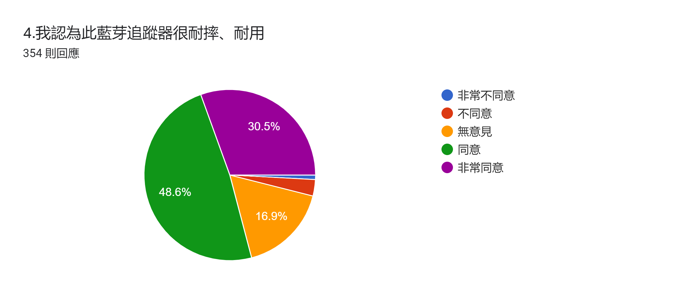
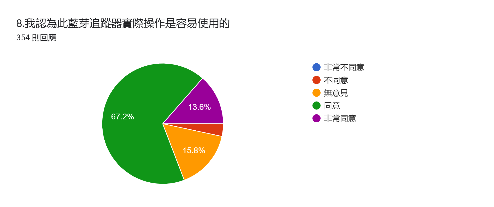
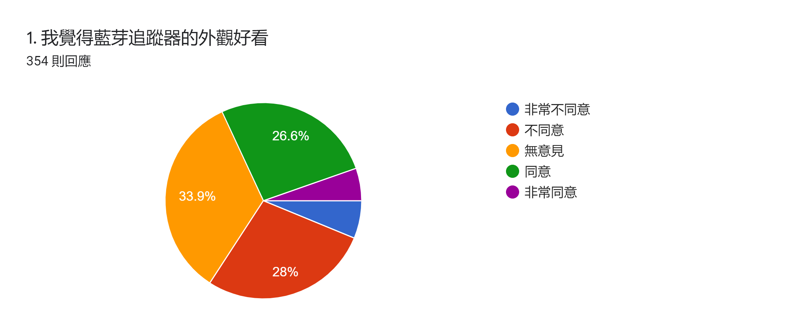

# 問卷（聚合）

訪期 **2021-12-25～12-28**。簡報：發出 370、有效 **354**、16 份因缺漏作廢。管道含校園 QR、LINE、巴哈姆特。

本倉**不上傳** csv／xlsx 與自由建議原文。數字來自專題簡報與「統計」資料夾的官方圓餅圖。

部分題目在問卷改版後才出現，故 Q9–Q13 的 *n* 約 66–68，不是 354。解讀購買意願時請看樣本數。

## 樣本

| 變項 | 分佈（354） |
| --- | --- |
| 性別 | 男 54.8% · 女 43.2% · 其他其餘 |
| 年齡 | 19 歲以下 30.8% · 20–35 歲 25.4% · 36–50 歲 12.7% · 50–65 歲 26% · 其餘 65 歲以上 |
| 學歷 | 大學 44.1% · 高中職 23.7% · 國中 18.1% · 碩士以上 10.7% · 其餘國小以下 |

## 量表（同意 + 非常同意）

| 題 | *n* | 正向合計 | 簡報解讀 |
| --- | --- | --- | --- |
| Q1 外觀好看 | 354 | 約 31%（同意 26.6%） | 外觀不受歡迎；中立 33.9%、不同意 28% |
| Q2 多色外殼更符合喜好 | 353 | 約 80%（60.9% + 19.5%） | 顏色選擇有需求 |
| Q3 示範影片讓人懂用法 | 354 | 約 85%（63.6% + 21.5%） | 影片說明清楚 |
| Q4 耐摔、耐用 | 354 | 約 79%（48.6% + 30.5%） | 耐摔被接受 |
| Q5 耐摔功能實用 | 354 | 約 80%（49.2% + 30.5%） | 同上 |
| Q6 APP 介面整齊 | 354 | 約 67%（55.9% + 10.7%） | 尚可，後段建議仍嫌配色 |
| Q7 APP 簡單易懂 | 351 | 約 78%（65.5% + 12.3%） | 操作不構成門檻 |
| Q8 實機容易使用 | 354 | 約 81%（67.2% + 13.6%） | 使用門檻低 |
| Q10 功能符合需求 | 66 | 同意 27.3%；中立 51.5% | 功能仍薄 |
| Q11 相信能找到遺失物 | 68 | 同意 36.8%；中立 41.2% | 信心不足 |
| Q12 願意購買 | 68 | 同意 14.7%；中立 42.6%；不同意 30.9% | 青壯年購買意願低 |
| Q13 願意推薦 | 68 | 同意 11.8%；中立 52.9% | 與購買意願一致 |

  

Q4 · n = 354。耐摔是分數最高的產品主張之一。

  

Q8 · n = 354。

  

Q1 · n = 354。外觀是主要扣分。

## 當年結論（不改寫）

簡報 SWOT 與建議排行，原句收斂如下：

- **強：** 外殼堅固、成本低、組內能自研。
- **弱：** 不美觀、工時長、功能少。
- **受訪者最常說：** 體積太大 → 外觀 → APP 不夠人性 → 點子還需研究 → 不該只靠藍芽。
- **購買：** 中老年較有意願，青壯年多無意願。
- 團隊自評：仍處研究階段，沒有與市售品競爭的條件。
